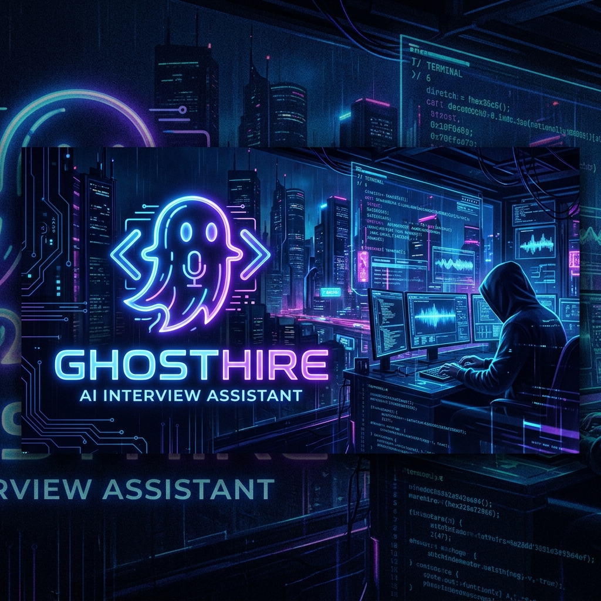

<div align="center">



# 👻 GhostHire — The Ultimate Stealth AI Interview Copilot


[](https://nodejs.org)
[](https://reactjs.org)
[](https://electronjs.org)
[](https://ai.google.dev/)
[](https://deepgram.com)

**GhostHire is an advanced, stealthy AI-powered assistant designed to silently support you during live technical interviews and coding assessments.**  
Featuring an invisible 0-footprint dual-overlay system, real-time lightning-fast audio transcription, instant AI vision processing, and a robust two-phase DSA solver.

[🚀 Getting Started](#-getting-started) • [✨ Features](#-features) • [🛡️ Stealth Mode](#-stealth--proctor-bypass) • [⌨️ Shortcuts](#-global-shortcuts) • [🏗️ Architecture](#-architecture)

</div>

---

## ✨ Features

| Feature | Description |
|---|---|
| 🛡️ **Dual Stealth Overlays** | Two click-through transparent UI windows (Vision & Audio) that remain **100% invisible** to screen sharing (Zoom, Meet, Teams) and anti-cheat/proctoring software. |
| ⚡ **Ultra-Fast Vision AI** | Powered by **Gemini Gen-3** (`gemini-3.5-flash-lite`, `gemini-3.8-flash`) for sub-second, highly accurate code and logic extraction from your screen. |
| 🎙️ **Live Subtitles & Streaming** | Real-time audio transcription via **Deepgram** that streams the interviewer's voice and AI's answer token-by-token directly onto your screen. |
| 📸 **Smart Screen Capture** | Use global hotkeys to capture questions instantly. Automatically manages screenshot caching for follow-ups without manual alt-tabbing. |
| 🧠 **Two-Phase DSA Solver** | **Phase 1 (Theory):** Explains Brute-force & Optimal approach in simple language to speak out loud.<br>**Phase 2 (Code):** Delivers clean, production-ready, optimally complex code. |
| 🚀 **Background Daemon** | The backend runs silently via **PM2** to bypass strict exam platform restrictions. |

---

## ⌨️ Global Shortcuts

GhostHire is designed to be operated entirely via keyboard during an interview, ensuring you never break eye contact:

| Shortcut | Action | Description |
|---|---|---|
| <kbd>Ctrl</kbd> + <kbd>Shift</kbd> + <kbd>X</kbd> | **Quick Explain (Theory)** | Captures screen & returns a fast theoretical explanation (Brute force + Optimal intuition). Perfect for talking to the interviewer. |
| <kbd>Ctrl</kbd> + <kbd>Shift</kbd> + <kbd>C</kbd> | **Get Optimal Code** | Captures a fresh screenshot and returns clean, optimized code with time/space complexity. |
| <kbd>Ctrl</kbd> + <kbd>Shift</kbd> + <kbd>Z</kbd> | **Toggle Vision Overlay** | Instantly hides/shows the main AI vision overlay from your screen. |
| <kbd>Ctrl</kbd> + <kbd>Shift</kbd> + <kbd>M</kbd> | **Toggle Mic Overlay** | Instantly hides/shows the dedicated Audio Transcription & AI Voice Assistant overlay. |

---

## 🛡️ Stealth & Proctor Bypass

GhostHire is built with absolute privacy and undetectability in mind:
- **`setContentProtection(true)`**: The Electron overlay windows are injected at the OS level to be excluded from standard screen capture APIs.
- **`setAlwaysOnTop('screen-saver')`**: The overlays aggressively stay on top of aggressive full-screen browser locks (like Internshala or SEB).
- **PM2 Daemon (`start-hidden.bat`)**: The Node.js backend runs completely in the background without any visible terminal windows.
- **Disguised Process Names**: Configured to appear as standard system processes (e.g., `WindowsAudioService`) in the Task Manager.

---

## 🏗️ Architecture

```text
Ghost_Hire/
├── backend/                  # Node.js + Express + PM2 Daemon
│   ├── server.js             # Main server (HTTP + WebSocket)
│   ├── routes/
│   │   ├── ai.js             # Gen-3 Vision & Fast Fallback Logic
│   │   └── ...               # Auth, Sessions, Logic
│   └── ecosystem.config.cjs  # PM2 configuration for background running
│
├── frontend/                 # React + Vite + Electron
│   ├── electron/
│   │   └── main.js           # Global shortcuts, Stealth window injection, IPC
│   ├── src/
│   │   ├── pages/
│   │   │   ├── Overlay.jsx   # Invisible transparent Vision UI
│   │   │   ├── MicOverlay.jsx# Invisible Live Transcription UI
│   │   │   └── Dashboard.jsx # Main WebSocket & Deepgram control panel
│   │   ├── App.jsx           # HashRouter (Electron compatible)
│   │   └── vite.config.js           
│
├── start-hidden.bat          # 1-click silent backend launcher
└── start-silent.vbs          # VBScript wrapper for absolute invisibility
```

---

## 🔑 Required API Keys

Create a `.env` file in the `backend/` directory:

```env
PORT=5000
MONGO_URI=mongodb+srv://<username>:<password>@cluster.mongodb.net/Interview_Tool
JWT_SECRET=your_super_secret_jwt_key_here

# AI Services
GEMINI_API_KEY=your_gemini_api_key_here
DEEPGRAM_API_KEY=your_deepgram_api_key_here
GROQ_API_KEY=your_groq_api_key_here
```

---

## 🚀 Getting Started

### 1️⃣ Clone & Install
```bash
git clone https://github.com/Codesmashersgit/Ghost_Hire.git
cd Ghost_Hire

# Install Backend
cd backend && npm install

# Install Frontend
cd ../frontend && npm install
```

### 2️⃣ Start Backend (Silent Mode)
Double-click `start-hidden.bat` in the root folder.
*(Alternatively, run `pm2 start backend/ecosystem.config.cjs` manually)*

### 3️⃣ Build & Run Desktop App
```bash
cd frontend
npm run electron-build
```
Open the generated `.exe` in `frontend/release/win-unpacked/` or install the setup file.

---

## 🧠 AI Models Used

| Model | Provider | Use Case |
|---|---|---|
| `gemini-3.5-flash-lite` | **Google (Gen-3)** | Primary — Ultra-fast screenshot analysis & code generation |
| `gemini-3.8-flash` | **Google (Gen-3)** | Fallback — Highly capable vision processing |
| `llama3-70b-8192` | **Groq** | Secondary — Text chat & rapid logic solving |
| `nova-2` | **Deepgram** | Primary — Live audio transcription via WebSocket |

---

## ⚡ Performance Upgrades

- **Zero API Quota Bottlenecks:** Integrated sequential fallback prevents rate-limiting (429) bans during high-frequency screenshot queries.
- **Hardware Acceleration:** Electron configured with `disable-gpu-shader-disk-cache` for maximum stability.
- **Low-Latency Streaming:** Audio transcription chunk limits reduced to 0.4s to ensure instantaneous AI answers upon speaking pause.

---

<div align="center">

Made with 💻 & ☕ by **Sudhanshu Raj**

⭐ **Star this repo if GhostHire helped you ace your interviews!** ⭐

</div>
